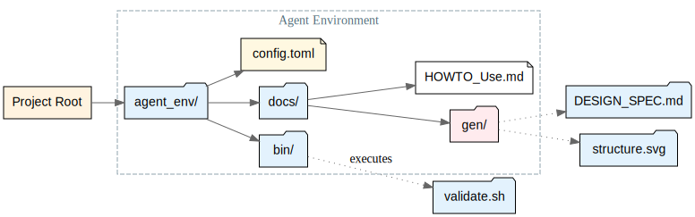
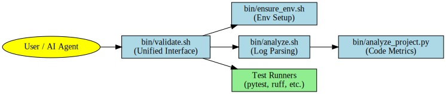
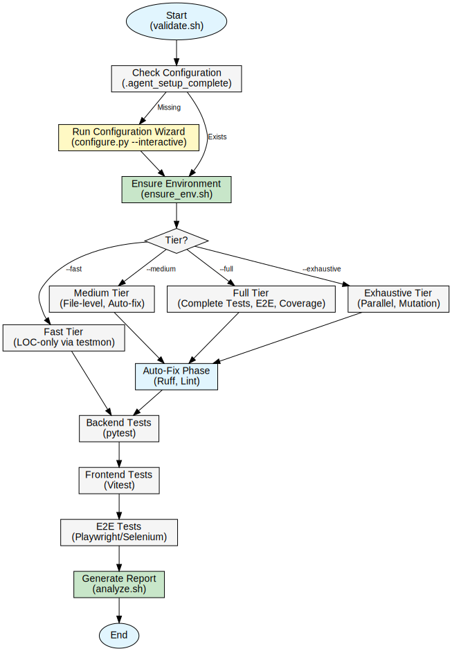

# HOWTO: Using and Integrating the Agent Development Environment

This guide explains how to use the Agent Development Environment (ADE) in your project and provides details on the included tooling.

## Why and How: The Philosophy of the Agent Kernel

The ADE exists to solve the "context gap" between an AI agent and a codebase. By providing a standardized interface—an **Agent Kernel**—the agent doesn't need to guess how to run your tests or check your types; it simply interacts with the kernel. This consistency reduces hallucinations and increases the speed of implementation. The kernel acts as an adapter, translating generic agent requests ("Validate this change") into repository-specific commands.

---

## 1. Setup & Configuration

This section explains how to integrate the environment into a new or existing project and set up your shell for seamless usage.

### Integration (Git Submodule)

The recommended way to use the ADE is as a Git Submodule. This keeps your project history clean while allowing you to easily update the environment.

```bash
git submodule add https://github.com/myheadwave/agent-dev-environment.git agent_env
```

### Configuration Wizard

The environment comes with an interactive configuration script. This wizard will:
1.  Help you enable/disable languages (Python, Node.js) and features.
2.  **Add the scripts to your PATH**, so you can run `validate.sh` from anywhere.

Run the wizard:

```bash
./agent_env/bin/configure.py --interactive
```

Once configured, you can verify your setup by running:

```bash
validate.sh --help
```

### Manual Configuration

If you prefer to configure manually or via scripts, you can edit `agent_env/config.toml` directly.

To add the tools to your PATH manually, add this to your `.bashrc` or `.zshrc`:

```bash
export PATH=$PATH:/absolute/path/to/project/agent_env/bin
```

---

## 2. Project Layout

Understanding the folder structure helps both users and agents navigate the environment efficiently.



- **`agent_env/bin/`**: The executables (`validate.sh`, `ensure_env.sh`).
- **`agent_env/docs/`**: Documentation and assets.
- **`agent_env/docs/gen/`**: **Auto-Generated Documentation**. This is where the environment outputs Design Specs (e.g., `AGENT_DESIGN_SPEC.md`).
- **Structure Map**: Generates a visual SVG map of the directory structure (e.g., `docs/gen/images/AGENT_structure.svg`), annotating files that have `## @DOC` blocks.

---

## 3. Design & Architecture

The Agent Kernel is designed to be **Self-Documenting**.

### Inline Documentation (`## @DOC`)

We strongly recommend using the `## @DOC` format in your code. This allows documentation to live right next to the logic it describes, reducing documentation drift.

```python
## @DOC
# ### Authentication Service
# The Auth service handles handles JWT issuance.
class AuthService:
    ...
```

Run `document.py` to extract these into `docs/gen/DESIGN_SPEC.md` and generate a project structure map.

### Doxygen API Documentation

For deep technical reference, the environment supports **Doxygen**:
- If `doxygen` is installed, `document.py` will generate full HTML/PDF API documentation in `docs/gen/doxygen/`.
- This is useful for agents to "read up" on complex internal APIs without needing to scan every source file.

### Architecture Diagram

The core script interaction flow is shown below:



1.  **Entry Point (`validate.sh`)**: Orchestrates the workflow.
2.  **Environment (`ensure_env.sh`)**: Manages dependencies (`uv`, `npm`).
3.  **Analysis (`analyze_project.py`)**: Reports on project health.

---

## 4. Workflows & Usage

### Common Commands

- `validate.sh --fast`: Run only the tests affected by current changes (~5s).
- `validate.sh --full`: Run all unit tests and generate coverage (~30s).
- `validate.sh --exhaustive`: Parallel execution with mutation testing (~5m).

### Agent-Driven TDD

1. **Agent Writes Test**: The agent identifies a requirement and writes a failing test.
2. **Validation**: The agent runs `validate.sh --fast`.
3. **Implementation**: The agent modifies code to pass the test.
4. **Coverage**: The agent runs `validate.sh --full` to ensure no blind spots.

---

## 5. Included Libraries & Tools

The environment ships with a curated set of high-performance tools.

| Tool/Library | Type | Size (Approx) | Description/Purpose |
| :--- | :--- | :--- | :--- |
| **uv** | CLI Tool | ~53 MB | Fast Python package installer and resolver. |
| **pandoc** | CLI Tool | ~148 MB | Universal document converter (used for PDF generation). |
| **doxygen** | CLI Tool | Variable | Standard API documentation generator. |
| **wkhtmltopdf** | CLI Tool | ~336 KB* | PDF rendering engine (*plus system dependencies). |
| **Graphviz** | CLI Tool | Variable | Diagram generation (`dot` command). |
| **pytest** | Python Lib | ~2 MB | Backend testing framework (Industry Standard). |
| **ruff** | Python Lib | ~20 MB | Rust-powered Linter & Formatter (Replaces Flake8/Black). |
| **pytest-cov** | Python Lib | < 1 MB | Coverage reporting. |
| **pytest-testmon** | Python Lib | < 1 MB | Incremental testing (Powers `--fast` mode). |
| **pytest-xdist** | Python Lib | < 1 MB | Parallel execution (Powers `--exhaustive` mode). |
| **pytest-timeout** | Python Lib | < 1 MB | Test timeout safety valve. |
| **tomli** | Python Lib | < 1 MB | TOML parsing for config files. |

> **Note**: Sizes represent the binary size on disk. Actual installation footprint may vary depending on shared system libraries.

## Troubleshooting & Tips

- **Missing .venv**: If scripts fail, ensure you've run `./bin/ensure_env.sh` at least once.
- **Path Issues**: The scripts are designed to find the project root automatically.
- **Agent Discovery**: Ensure your `README.md` points to this HOWTO so new AI agents can quickly understand the system.

## Agent Workflows & Requests

To request work from an agent, simply describe your task in natural language in the chat interface. The agents follow a structured loop:

1.  **Plan**: The agent will analyze your request and the codebase, then propose an `implementation_plan.md`. You should review this plan carefully.
2.  **Execute**: Once the plan is approved, the agent will execute the changes, modifying code and running commands.
3.  **Verify**: The agent will verify the changes using tests or checks and create a `walkthrough.md` to demonstrate the results.

### Tips for Best Results
- Be specific about what you want.
- Reference specific files or error messages.
- If a task is complex, ask for a plan first.

## Best Practices: GitHub Repository Setup

To fully utilize the Agent workfow, you should enforce validation on every Pull Request.

### 1. Branch Protection Rules

1.  Go to your repository on GitHub.
2.  Navigate to **Settings** > **Branches**.
3.  Click **Add branch protection rule**.
4.  **Branch name pattern**: `main`
5.  Check the following options:
    *   [x] **Require a pull request before merging**
    *   [x] **Require status checks to pass before merging**
        *   Search for and select: `validate` (The job name from `.github/workflows/pr_validation.yml`)
    *   [x] **Do not allow bypassing the above settings** (Optional, but recommended)
6.  Click **Create**.

### 2. Verify Workflows

1.  Create a test Pull Request.
2.  Ensure that the "PR Validation" check runs and passes.
3.  Verify that you cannot merge until the check passes.

## Agent Workflows

Workflows are pre-defined sets of instructions that agents can access to perform common tasks consistently. You can trigger these by name or by asking for the specific task.

### Available Workflows

<!-- WORKFLOWS_START -->
| Command | Description |
| :--- | :--- |
| `/architecture` | Architectural Changes and Big Feature Implementations |
| `/cleanup` | Cleanup system files, caches, and logs |
| `/css-review` | Review CSS compliance and design system usage before merging |
| `/design-planning` | Design and Planning tasks (UI/UX, System Design) |
| `/docs-path-integrity` | How to maintain path integrity and avoid absolute paths in documentation |
| `/security-review` | Perform a basic security review of the project |
| `/ux-review` | Perform a UX and Accessibility Review of the application |
| `/validate` | Run exhaustive QA and full project validation |
<!-- WORKFLOWS_END -->

## Automatic Updates

This list is automatically updated by `bin/update_workflow_docs.py`.

## Appendix: Understanding Generated Diagrams

When Doxygen is enabled, the generated documentation in `docs/gen/doxygen/` includes several types of automated diagrams to help you understand the code structure.

### 1. Class Hierarchy (Inheritance)
These diagrams show how classes inherit from one another.
- **Arrows** point from the child class to the parent class.
- **Boxes** represent classes.

### 2. Call Graphs
These diagrams visualize the runtime flow of your application.
- **Call Graph**: Shows which functions are called *by* a specific function.
- **Caller Graph**: Shows which functions *call* a specific function.
- **Why it's useful**: Helps identify dependencies and impact analysis when refactoring.

### 3. Directory Dependency Graphs
Visualizes how different directories (modules) depend on each other based on import statements.

---

## Appendix: Advanced Architecture & Ecosystem

### 1. Dual-Mode Execution

The Agent Kernel is designed to be context-aware, running seamlessly in two distinct environments:
- **Standalone Mode**: Used when developing the kernel itself. The system detects it is at the root and manages its own dependencies.
- **Submodule Mode**: The standard integration path. The kernel detects it is in a subdirectory (e.g., `agent_env/` or `.agent/`) and validates the **Host Project** while referencing the host's configuration.

### 2. Triple-Layer Configuration

Configuration is separated to distinguish between internal environment needs and project-specific adapters:
1. **Layer 1: Environment Build (`pyproject.toml`)**: Defines dependencies for the kernel's tools (Ruff, Pytest, Pandoc).
2. **Layer 2: Adapter Config (`config.toml`)**: Defines how the kernel maps to YOUR project (which test command to run, where the source code is).
3. **Layer 3: Starter Template (`config.example.toml`)**: A reference for new integrations.

### 3. Validation Workflow

The `validate.sh` script follows a structured logical flow to ensure reliability:



1. **Setup**: Verifies configuration and environment health.
2. **Tier Selection**: Determines the depth of testing (--fast, --medium, --full, --exhaustive).
3. **Auto-Fix**: Runs linters and formatters to maintain code quality.
4. **Execution**: Orchestrates Backend, Frontend, and E2E tests.
5. **Analysis**: Consolidates results into a unified markdown report.

### 4. The Developer Support Ecosystem

An AI Agent, much like a Junior Developer, operates within a complex ecosystem of humans and workflows. Success requires input from multiple roles:


- **Senior Developers / Tech Leads**: Provide architectural guardrails and detailed code reviews.
- **Product Managers**: Provide the "Why" and specific business priorities.
- **QA Engineers**: Cultivate a quality-first mindset and provide feedback on edge cases.
- **Platform Engineers**: Ensure stable CI/CD pipelines and deployment environments.

> [!NOTE]
> **Future Extension: Multi-Agent Ecosystems**
> In the future, these roles (PM, QA, DevOps) may themselves be specialized AI Agents. The Kernel is designed to support this evolution by providing a standard interface that any agent can consume to contribute to the lifecycle.

